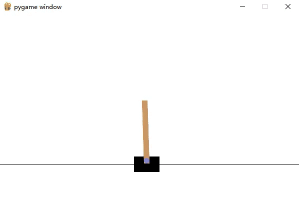
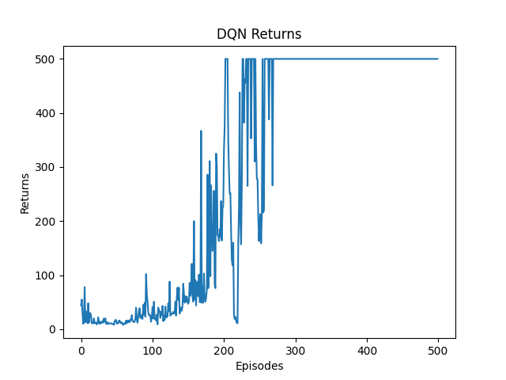

# CartPort Agent

A DQN agent trained for the CartPort game in the OpenAI gym environment. See the game [here](https://gymnasium.farama.org/environments/classic_control/cart_pole/).




## What's included

- Trained DQN agent
- Script for playing using the trained agent
- Script for training a new agent

## How to use it

### Installation

Make sure you have Python 3.10 installed. Then, install the environment using `pip --no-cache-dir install -r requirements.txt`. If this fails for some reason the main requirements are:

- `torch 2.0.1+cu118`
- `torchaudio 2.0.2+cu118`
- `torchvision 0.15.2+cu118`
- `gym 0.26.2`
- `gym[classic_control]`
- `matplotlib 3.7.1`
- `tqdm 4.65.0`

The former versions of gym might not work. So it is recommended to use the exact versions specified above.

### Play using a saved model

Just do:

```shell
python play.py
```

### Train a new model

Just do:

```shell
python train.py
```

## Related project

[LiSir-HIT](https://github.com/LiSir-HIT) provides the training code for the DQN agent. I used his code as a starting point and modified it to fit my needs. You can find his original code [here](https://github.com/LiSir-HIT/Reinforcement-Learning/tree/main/Model/).
